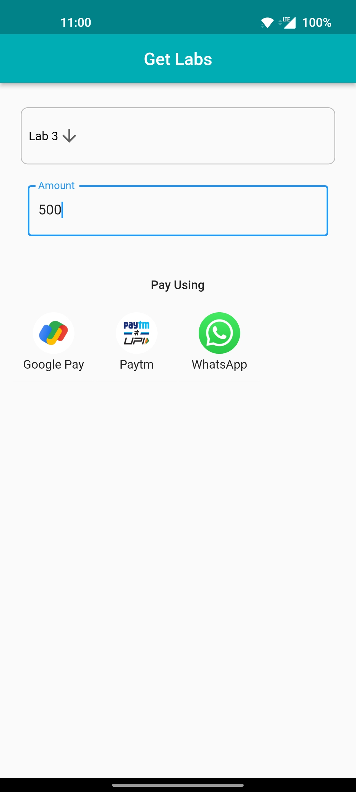

# GetLab

- The GetLab App is a frontend application developed using Flutter and Firebase.
- It provides users with a convenient way to discover all UPI (Unified Payments Interface) supported apps installed on their device.
- Additionally, it offers a seamless lab booking experience for affiliated labs.
- [📦.apk](https://github.com/Akshit1903/GetLab/raw/main/app-release.apk) :For testing purposes
- [📽️YouTube](https://youtu.be/xtN13ksUKRw) Video

## Screenshots



## Features

- UPI App Finder: Automatically detects and displays all UPI supported apps installed on the user's device.
- Lab Booking (Hypothetical): Allows users to book labs affiliated with the app effortlessly.
- User-Friendly Interface: The app offers a user-friendly and intuitive design for easy navigation and usage.

## Technologies Used

- Flutter: A cross-platform UI toolkit for building natively compiled applications.

## Installation

- Clone the repository:
  ```shell
  git clone https://github.com/Akshit1903/GetLab
  ```
- Navigate to the project directory:
  ```shell
  cd easy-mi
  ```
- Install the required dependencies:
  ```shell
  flutter pub get
  ```
- Configure a device and run the app

  ```shell
  flutter run
  ```

  Alternativly, you can download `.apk` file from <a href="https://github.com/Akshit1903/GetLab/raw/main/app-release.apk"> here</a> and follow the steps:

- Launch the GetLab App on your mobile device.
- The app will automatically detect and display all UPI supported apps installed on your device.
- To book a lab, select the desired affiliated lab from the available options.
- Follow the provided instructions to complete the lab booking process.
- Enjoy the seamless experience of finding UPI supported apps and booking labs with the app!

## Future Scope:

- Lab data integration with DB.
